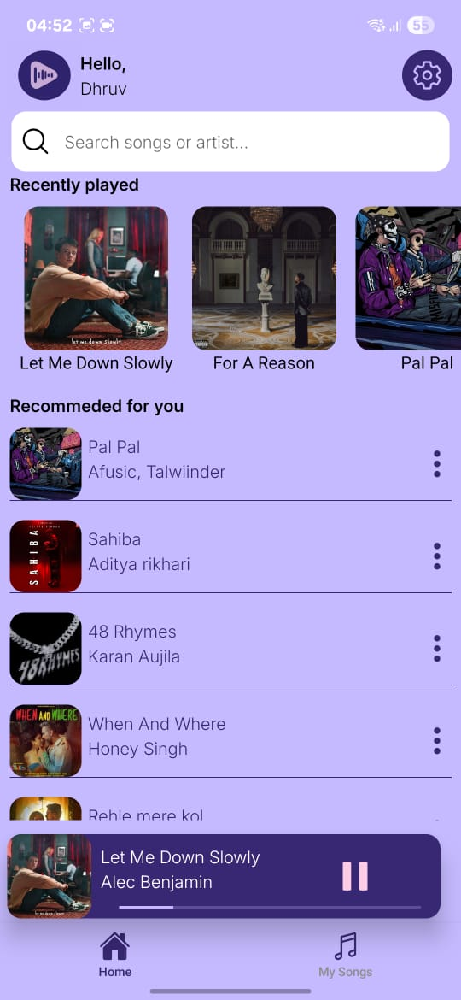
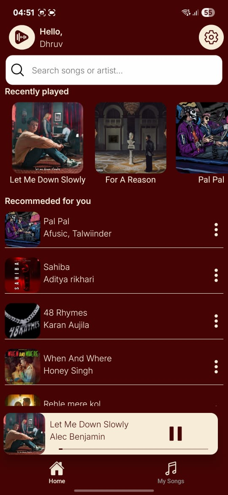
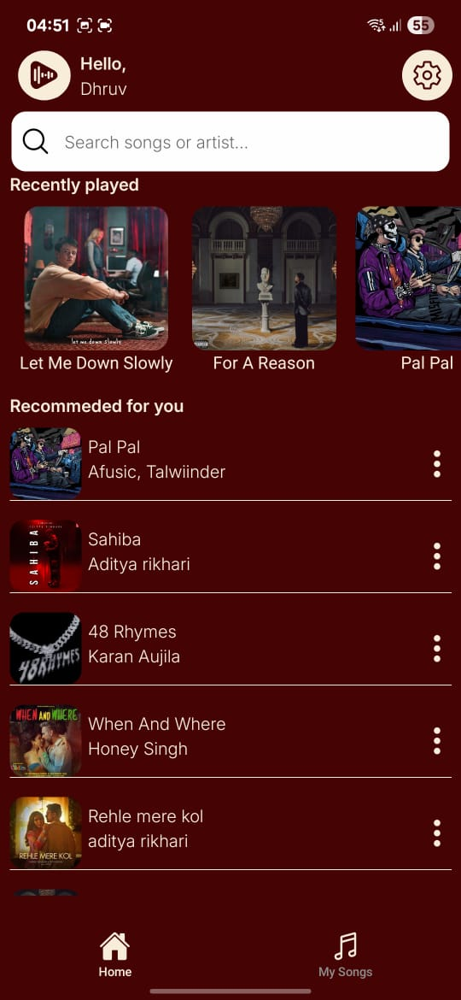

## 🎶 AudioBeats

[](./LICENSE)
[](https://expo.dev)
[]()

A fully functional cross-platform music app built with **React Native + Expo** and powered by **Firebase**.

---

## 📚 Table of Contents

- [Features](#-features)
- [Screenshots](#-screenshots)
- [Installation](#-installation)
- [Tech Stack](#-tech-stack)
- [Authors](#-authors)
- [Contributing](#-contributing)
- [License](#-license)

---

## 🚀 Features

- 🎨 **Theme Functionality**: Switch between Royal and Default themes.
- 🔐 **Authentication**: Secure user management with Firebase Auth.
- 📂 **Playlists**: Create, delete, and manage playlists.
- 📥 **Offline Playback**: Download songs for offline listening.
- ❤️ **Favorites**: Quick access to favorite tracks.
- 🔁 **Loop Mode**: Loop current song or full playlist.
- 🎵 **Mini Player**: Swipe gestures for previous/next song.
- 🕑 **Recently Played**: Access your play history.
- 🔍 **Search**: Fast search for songs or artists.
- 🤲 **Gesture-based Detail View**: Drag-down animation for music details.

---

## 📸 Screenshots

<details>
<summary>🏠 Home Tab</summary>
<p float="left">
  
  
  
</p>
</details>

<!-- Repeat <details> for other sections -->

---

## 📦 Installation

1. **Clone the repository:**
   ```bash
   git clone https://github.com/Dhruv-K12/AudioBeats.git
   cd AudioBeats
   ```

2. **Install dependencies:**
   ```bash
   npm install
   # or
   yarn install
   ```

3. **Start the app:**
   ```bash
   npx expo start
   ```

4. **Configure Firebase:**
   - [Create a Firebase project](https://firebase.google.com/docs/web/setup).
   - Copy your Firebase config object into `firebaseConfig.js`.

---

## 🛠 Tech Stack

- **Client:** TypeScript, React Native, Expo, Reanimated, Lottie, Zustand
- **Server:** Firebase

---

## 👨‍💻 Authors

- [Dhruv Kumar (GitHub)](https://github.com/Dhruv-K12)
- [Dhruv Kumar (LinkedIn)](https://www.linkedin.com/in/dhruv-kumar-73590030a/)

---

## 🤝 Contributing

Contributions are welcome! Please open an issue or pull request. For major changes, please open an issue first to discuss what you would like to change.

---

## 📄 License

This project is licensed under the **MIT License** – see the [LICENSE](./LICENSE) file for details.


