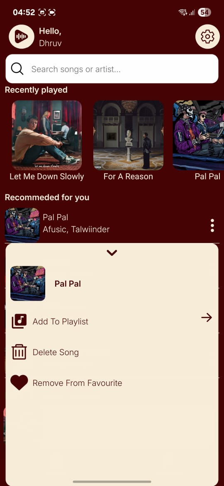
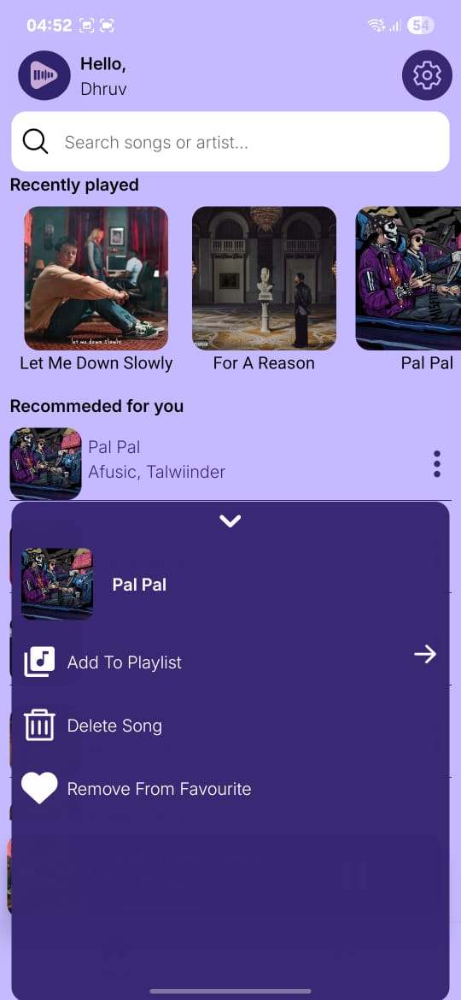
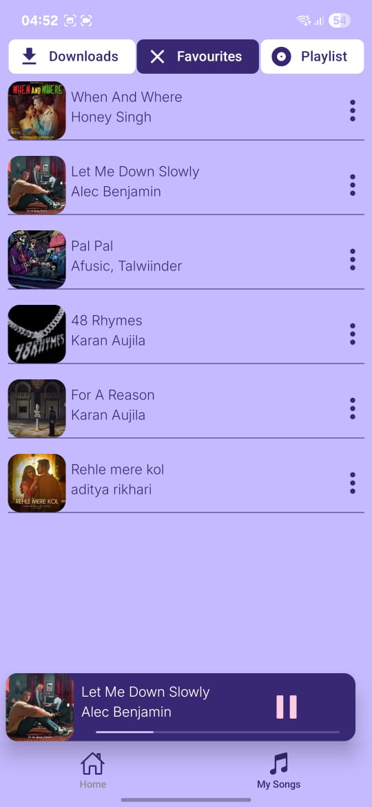
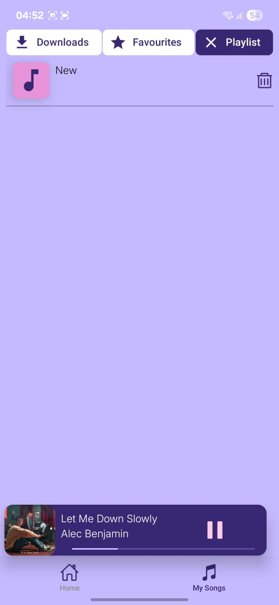
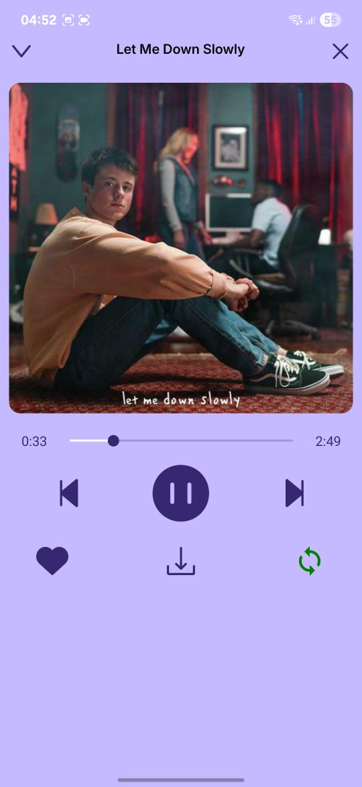
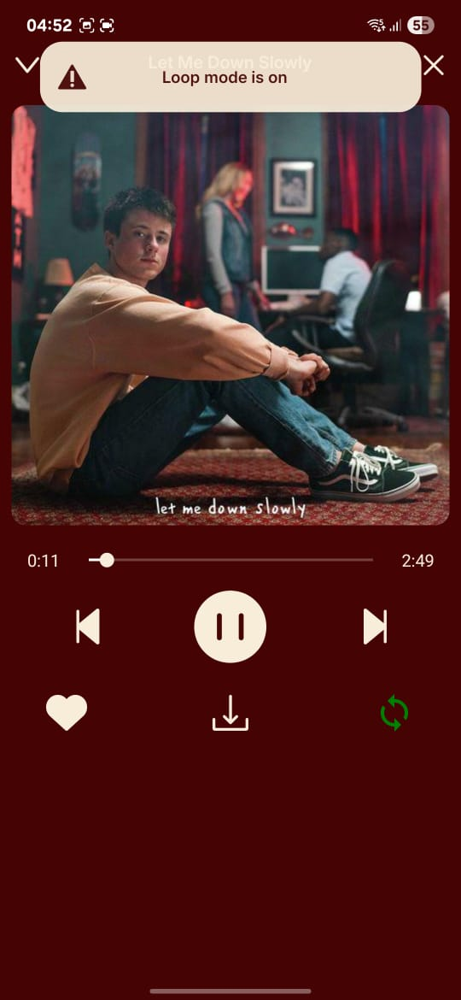
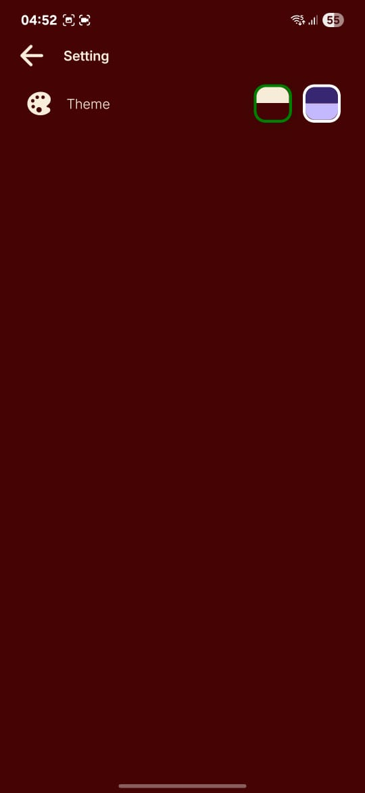

## 🎶 AudioBeats

A fully functional cross-platform music app built with **React Native + Expo** and powered by **Firebase**.

---

## 🚀 Features

- 🎨 **Theme Functionality**: Switch between Royal and Default themes.  
- 🔐 **Authentication**: Sign up, log in, and log out users securely using Firebase Auth.  
- 📂 **Playlists**: Create, delete, and manage playlists; add songs to playlists.  
- 📥 **Offline Playback**: Download songs to play offline within the app.  
- ❤️ **Favorites**: Add your favorite songs for quick access.  
- 🔁 **Loop Mode**: Loop the current song or the entire playlist.  
- 🎵 **Mini Player**: Swipe left/right to play the previous or next song.  
- 🕑 **Recently Played**: View your recently played songs.  
- 🔍 **Search**: Search for songs or artists quickly.  
- 🤲 **Gesture-based Music Detail View**: Interact with the music detail screen using drag-down animation.  

---

## 👨‍💻 Authors
- [GitHub](https://github.com/Dhruv-K12)  
- [LinkedIn](https://www.linkedin.com/in/dhruv-kumar-73590030a/)  

---

## 🛠 Tech Stack
**Client:** TypeScript, React Native, Expo, Reanimated, Lottie, Zustand  
**Server:** Firebase  

---
📸 Screenshots

🏠 Home Tab
<p float="left">    </p>

📜 Bottom Sheet
<p float="left">   </p>

🎵 My Songs Tab
<p float="left">   </p>

🎶 Music Detail Screen
<p float="left">   </p>

⚙️ Settings Screen
<p float="left">  </p>

---

## 📦 Installation

Clone the repository:
```bash
git clone https://github.com/Dhruv-K12/AudioBeats.git
cd AudioBeats

npm install
# or
yarn install

npx expo start

Add Firebase configuration

Create a Firebase project.

Copy your Firebase config object into firebaseConfig.js (or the file where you store it).

```

---

## 📄 License

This project is licensed under the **MIT License** - see the [LICENSE](./LICENSE) file for details.


